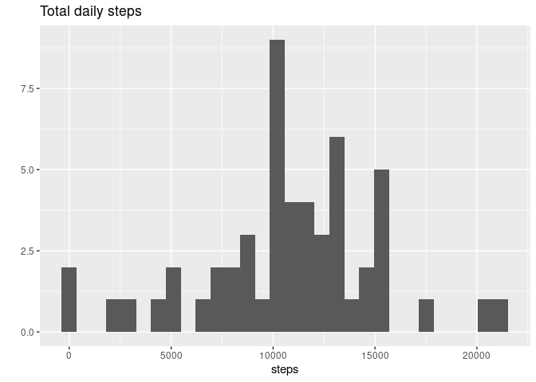
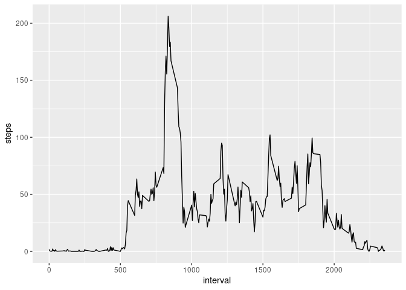
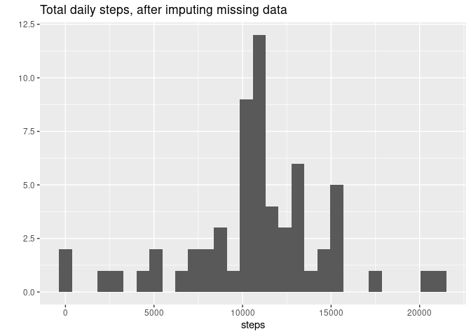
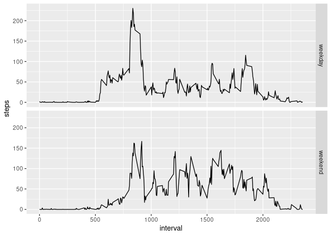

## Introduction
It is now possible to collect a large amount of data about personal movement using activity monitoring devices such as a Fitbit, Nike Fuelband, or Jawbone Up. These type of devices are part of the “quantified self” movement – a group of enthusiasts who take measurements about themselves regularly to improve their health, to find patterns in their behavior, or because they are tech geeks. But these data remain under-utilized both because the raw data are hard to obtain and there is a lack of statistical methods and software for processing and interpreting the data.

This assignment makes use of data from a personal activity monitoring device. This device collects data at 5 minute intervals through out the day. The data consists of two months of data from an anonymous individual collected during the months of October and November, 2012 and include the number of steps taken in 5 minute intervals each day.

The variables included in the dataset are:

- steps: Number of steps taking in a 5-minute interval (missing values are coded as NA\color{red}{\verb|NA|}NA)
- date: The date on which the measurement was taken in YYYY-MM-DD format
- interval: Identifier for the 5-minute interval in which measurement was taken

## Loading required libraries


```r
library(tidyverse)
```

## Loading and preprocessing the data


```r
unzip("activity.zip")
data <- read.csv("activity.csv")
data <- data %>% 
    #mutate(interval = as.factor(interval)) %>% 
    mutate(date = as.Date(date))
```


## What is mean total number of steps taken per day?

Calculating the total number of steps taken per day:

```r
daily_steps <- data %>% group_by(date) %>% summarise(steps = sum(steps))
```

Plotting the distribution of daily steps:

```r
 qplot(steps, data=daily_steps, geom="histogram", main="Total daily steps")
```

<!-- -->

Calculating the mean and median total number of steps taken per day:

```r
mean_daily_steps <- mean(daily_steps$steps, na.rm=TRUE)
median_daily_steps <- median(daily_steps$steps, na.rm=TRUE)
```

The mean total number of steps per day is 10766.
The median total number of steps per day is 10765.

## What is the average daily activity pattern?

Plotting the average number of steps taken for each 5-minute interval, averaged across all days, as a time series:

```r
ggplot(data, aes(x = interval, y = steps)) + 
  geom_line(stat = "summary", fun = "mean")
```

<!-- -->

```r
max_steps <- data %>% group_by(interval) %>% 
    summarise(steps=mean(steps, na.rm=TRUE)) %>% 
    slice(which.max(steps))
```

The 5-minute interval, on average across all the days in the dataset,  that contains the maximum number of steps is the one that start at 835 minutes, with 206 steps.


## Imputing missing values

Calculating the total number of missing values in the dataset:

```r
number_na <- sum(is.na(data$steps))
fraction_na <- mean(is.na(data$steps))
```
There is 2304 rows with missing values in the dataset, that is 13% of the total number of rows.

Creating a new dataset with missing values filled in, by using the mean for that 5-minute interval : 

```r
data_full <- data %>% 
    group_by(interval) %>%
    mutate(steps = case_when(
        is.na(steps) ~ as.integer(mean(steps,na.rm=TRUE)),
        TRUE ~ steps)
        )
```

Calculating the total number of steps taken per day for the dataset after imputing missing data:

```r
daily_steps_full <- data_full %>% group_by(date) %>% summarise(steps = sum(steps))
```

Plotting the distribution of daily steps after imputing missing data:

```r
qplot(steps, data=daily_steps_full, geom="histogram", main="Total daily steps, after imputing missing data")
```

<!-- -->

Calculating the mean and median total number of steps taken per day after imputing missing data:

```r
mean_daily_steps_full <- mean(daily_steps_full$steps)
median_daily_steps_full <- median(daily_steps_full$steps)
```

The mean total number of steps per day, after imputing missing data, is 10749.
The median total number of steps per day, after imputing missing data, is 10641.


```r
library(knitr)
kable(
    data.frame("mean daily steps" = c(mean_daily_steps, mean_daily_steps_full),
               "median daily steps" = c(median_daily_steps, median_daily_steps_full),
               row.names = c("with missing values", "after imputing missing values")
               )
)
```


|                              | mean.daily.steps| median.daily.steps|
|:-----------------------------|----------------:|------------------:|
|with missing values           |         10766.19|              10765|
|after imputing missing values |         10749.77|              10641|
As we can see in the above table, imputing the missing values with the strategy that we used did have an impact on the mean and median daily steps. 

We can also see, by comparing the total daily steps histograms before and after imputing the missing values, that it did visibly impact the total daily average.  

## Are there differences in activity patterns between weekdays and weekends?

Calculating the average number of steps taken for each 5-minute interval, averaged across all days, and plotting the pattern as a time series, for weekday and weekends:

```r
data_full <- data_full %>% mutate(
    day_type = case_when(
        weekdays(as.Date(date)) == "samedi" | 
            weekdays(as.Date(date)) == "dimanche" ~ "weekend",
        TRUE ~ "weekday"  ))

ggplot(data_full, aes(x = interval, y = steps)) + 
    geom_line(stat = "summary", fun = "mean") +
    facet_grid(rows = vars(day_type))
```

<!-- -->

As we can see in the above plot, there is a difference in activity patterns between weekdays and weekends.
